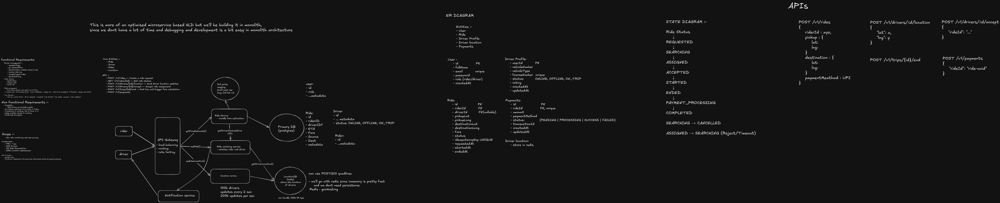
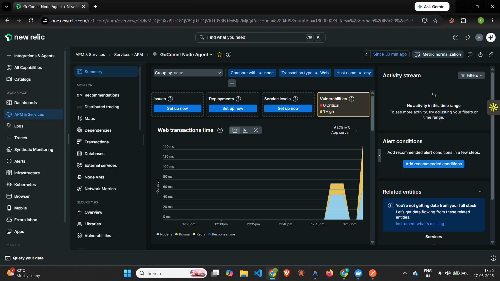
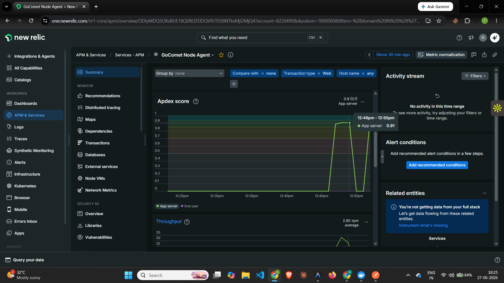
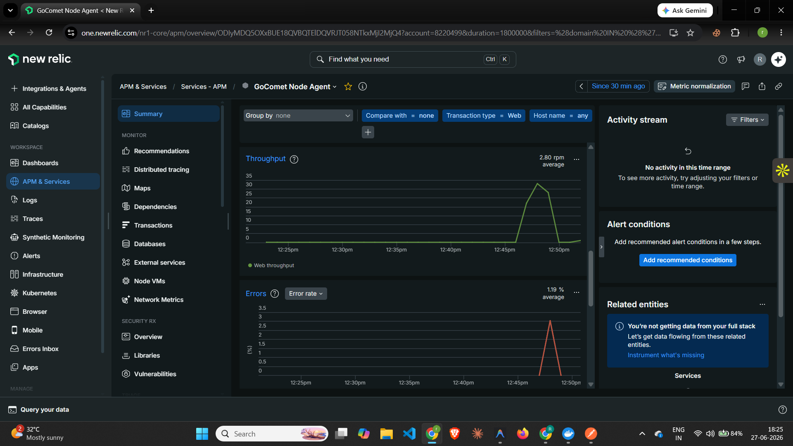
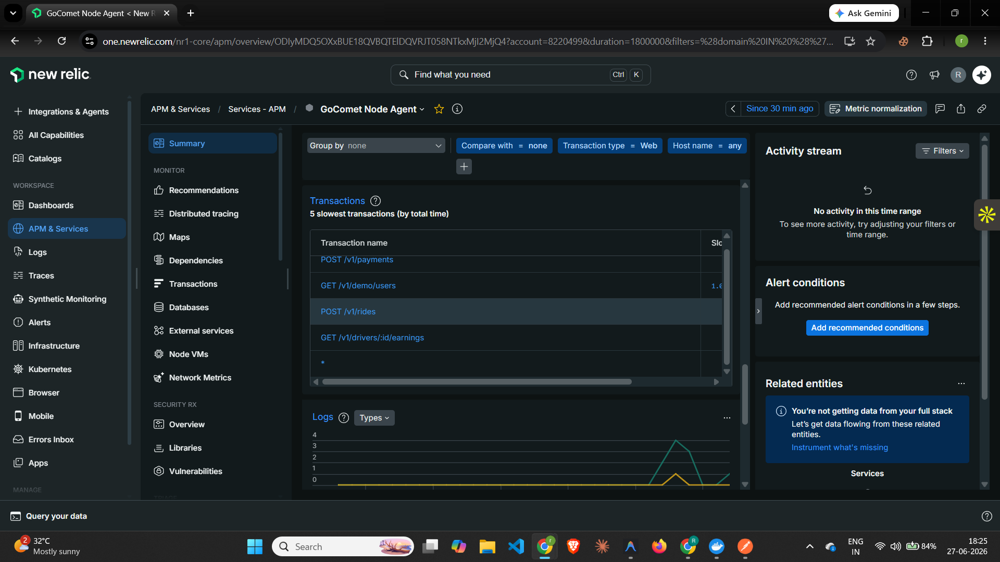
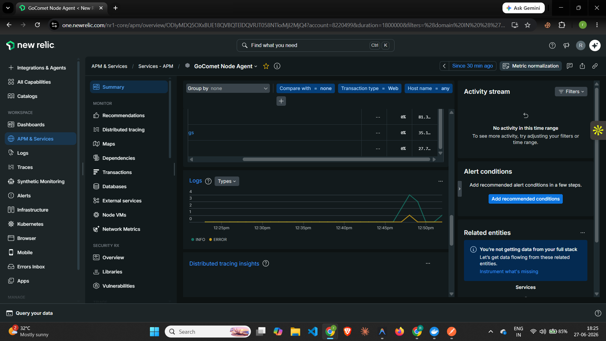
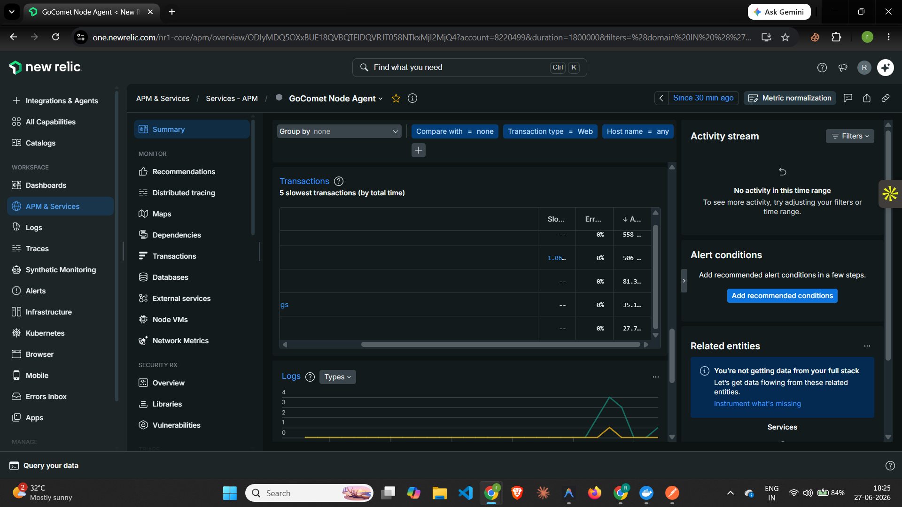

# 🚖 GoComet Ride Hailing Platform

<p align="center">
  
</p>

<p align="center">


</p>

A production-inspired ride hailing platform built as part of the **GoComet Backend Engineering Assessment**. The project demonstrates scalable backend architecture, real-time communication, ride lifecycle management, payment processing, Redis caching, idempotent APIs, monitoring with New Relic, and clean modular design.

---

# 📌 Project Overview

The application simulates the backend of a ride-hailing platform similar to Uber/Ola.

Although implemented as a **Modular Monolith**, the project follows clean service boundaries, making it straightforward to evolve into a Microservice architecture in the future.

Core capabilities include:

- Ride Booking
- Driver Matching
- Driver Location Tracking
- Ride State Management
- Payment Processing
- Driver Earnings
- Real-Time Updates
- New Relic Monitoring

---

# ✨ Features

## Rider

- Request Ride
- View Ride Status
- Pay after Trip Completion

## Driver

- Update Live Location
- Accept Ride
- End Trip
- View Total Earnings

## Platform

- Real-Time Ride Assignment
- Atomic Driver Assignment
- Redis Driver Location Cache
- Idempotent Ride Creation
- Payment Processing
- Socket.IO Notifications
- New Relic Monitoring

---

# 🏗 High Level Architecture

The system follows a layered architecture consisting of Controllers → Services → Repositories → Database.

<p align="center">

</p>

---

# ⚙ Tech Stack

## Backend

- Node.js
- Express.js
- TypeScript
- Prisma ORM
- PostgreSQL
- Redis
- Socket.IO
- Zod
- Jest
- New Relic

## Frontend

- React
- Vite
- TailwindCSS
- Axios
- React Hot Toast
- Socket.IO Client

---

# 📂 Folder Structure

```text
backend
│
├── prisma
├── src
│   ├── config
│   ├── middleware
│   ├── modules
│   │   ├── demo
│   │   ├── driver
│   │   ├── payment
│   │   ├── ride
│   │   └── trip
│   ├── socket
│   └── utils
│
frontend
│
├── src
│   ├── components
│   ├── services
│   ├── socket
│   └── types
```

---

# 🗄 Database Design

The platform uses PostgreSQL for all persistent data.

### User

Stores both Riders and Drivers.

```
id
fullName
email
password
role
```

### DriverProfile

```
vehicleNumber
vehicleType
licenseNumber
status
rating
```

### Ride

```
pickup
destination
fare
status
driverId
riderId
idempotencyKey
requestedAt
startedAt
endedAt
```

### Payment

```
rideId
amount
paymentMethod
status
transactionId
```

---

# 🚕 Ride Lifecycle

```
REQUESTED
      │
SEARCHING
      │
ASSIGNED
      │
ACCEPTED
      │
STARTED
      │
ENDED
      │
COMPLETED
```

State transitions are validated to prevent inconsistent ride updates.

---

# 🚀 REST APIs

## Ride

```
POST /v1/rides
```

Create Ride

---

## Driver

```
POST /v1/drivers/:id/location
POST /v1/drivers/:id/accept
GET  /v1/drivers/:id/earnings
```

---

## Trip

```
POST /v1/trips/:id/end
```

---

## Payment

```
POST /v1/payments
```

---

## Demo

```
GET /v1/demo/users
```

---

# ⚡ Redis Usage

Redis is used for:

- Driver Location Storage
- Fast Driver Lookup
- Low-latency Reads
- Temporary In-memory Data

Persistent business data remains in PostgreSQL.

---

# 🔄 Real-Time Communication

Socket.IO provides instant updates between Rider and Driver.

Events:

- Driver Assigned
- Trip Ended
- Payment Completed

No polling is required.

---

# 🔒 Reliability Features

- Idempotent Ride Creation
- Atomic Driver Assignment using Database Transactions
- Request Validation using Zod
- Repository Pattern
- Layered Architecture
- Global Error Handling

---

# 📊 Application Monitoring

The backend is instrumented using **New Relic APM**.

Monitored metrics include:

- API Throughput
- Request Latency
- Database Queries
- Transaction Traces
- Error Rate
- Application Health
- Response Time
- Apdex Score

---

## New Relic Dashboard

### APM Overview



---

### Transactions



---

### Throughput & Errors



---

### Response Time & Apdex



---

### Database Performance



---

### Overall Monitoring Dashboard



---

# 💰 Driver Earnings

```
GET /v1/drivers/:id/earnings
```

Returns:

- Completed Trips
- Total Earnings

---

# ▶ Running the Project

## Backend

```bash
cd backend

npm install

npx prisma migrate dev

npx prisma db seed

npm run dev
```

---

## Frontend

```bash
cd frontend

npm install

npm run dev
```

---

# 🔮 Future Improvements

- Redis GEO Indexing for Nearest Driver Search
- JWT Authentication
- Surge Pricing
- ETA Calculation
- Route Optimization
- Kafka/RabbitMQ Event Streaming
- Rate Limiting
- Docker Deployment
- Kubernetes Support
- CI/CD Pipeline
- Microservice Migration

---

# 📹 Demo

The demonstration covers:

- Ride Creation
- Driver Location Update
- Driver Acceptance
- Trip Completion
- Payment Processing
- Driver Earnings
- New Relic Monitoring

---

# 👨‍💻 Author

**Robin Singh**

Backend Software Engineer

Built for the **GoComet Backend Engineering Assessment**.
